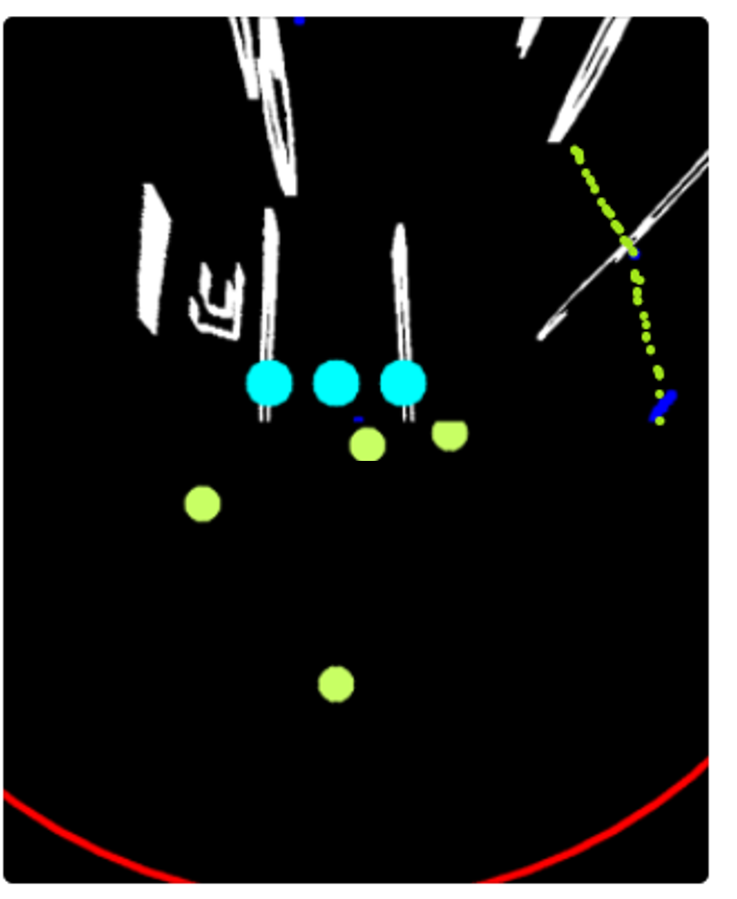
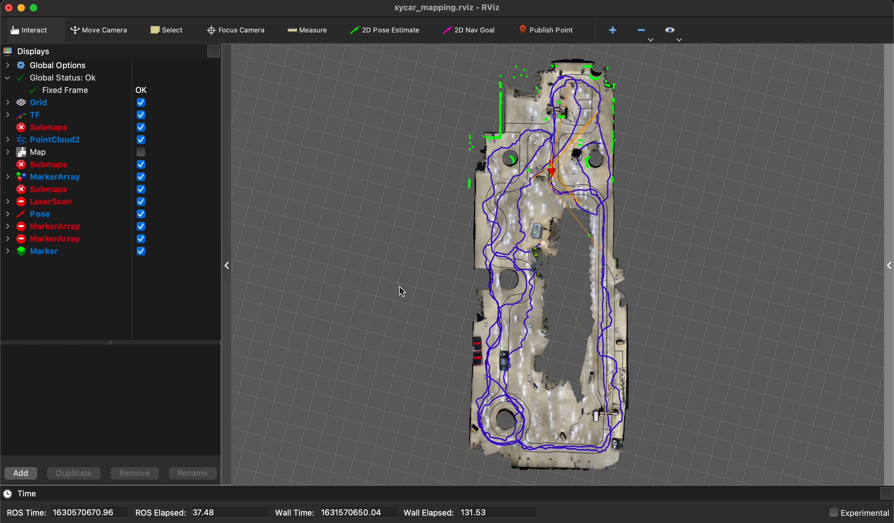
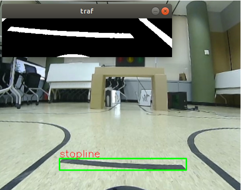
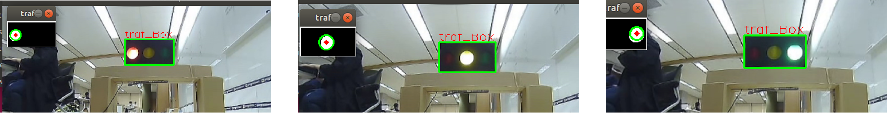
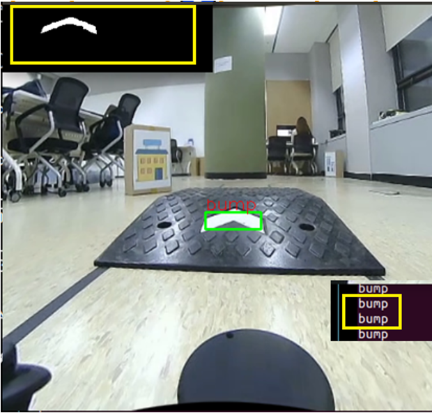
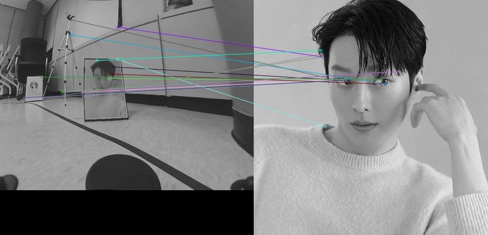
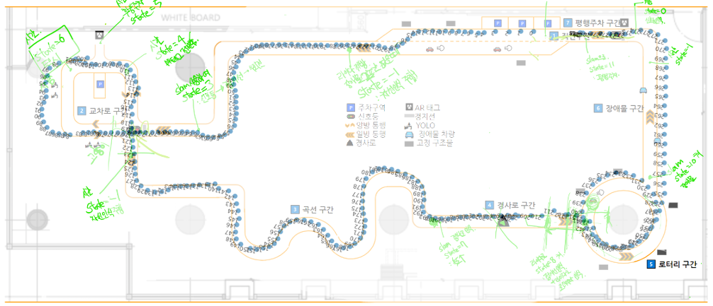
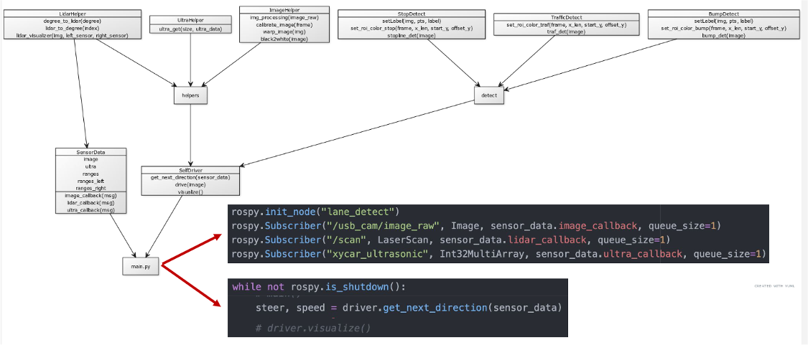

# Autonomous Driving Project (final project of autonomous driving course)
Implement autonomous driving algorithms using 1/10 scale model car ([Xycar model D](http://xytron.co.kr/wp-content/uploads/%EC%9E%90%EC%9D%B4%ED%8A%B8%EB%A1%A0-%EC%9E%90%EC%9D%B4%EC%B9%B4D%EB%AA%A8%EB%8D%B8-%EC%A0%9C%ED%92%88%EC%86%8C%EA%B0%9C%EC%84%9C-2021-0801.pdf)). This project was conducted as the final project of [the __K-Digital-Training: 자율주행 데브코스__ program by Grepp](https://programmers.co.kr/learn/courses/11614). Click the following demo gif to view [in Youtube](https://youtu.be/8LzUUPVyS1I?t=2090).

# Project Description
* Team organization - four teammates

| Name           | Role |
| ---            | --- |
| Hyunwoo Park   | Lane detection, Driving control, Lane changing, Parking |
| Yongjae Lee    | Image feature matching, Software architecture design, Cartographer tuning, RViz 3D map visualization, YOLO |
| Hyunji Lee     | Cartographer tunining, Lane detection, Rotary driving, Obstacle dodging |
| Hui-dong Hwang | {Stop line, Traffic light, speed bump} detection |

* Milestone

| Time           | Description |
| :------------: | --- |
| 8.23           | Team building |
| 8.25 - 8.27    | Mission analysis and planning |
| 8.30 - 9.3     | Lane detection, Monitoring interface, Stop line, Traffic light, Cartographer tunning |
| 9.6 - 9.10     | Parking |
| 9.13 - 9.16    | Cartographer tunning, Rotary driving, Obstacle dodging, Image feature matching, Code integration, Code refactoring |
| 9.17           | Final competition |

* Monitoring interface
  * 
  * Upper half: bird eye view from front usb cam
    * Cyan colored dots: left lane, lane center, right Lane
    * White lines: extracted lines
    * small green dots: lidar points
  * Lower half: ultra sonic sensors in rear
    * Big green dots: ultra sonic sensor result

* RViz 3D map visualization
  * 
  * Floated scanned 3D model of competition track as a background, upon that, showed `/points2`, `/tracked_pose` topic.
  * Refer [this repository](https://github.com/nfyfamr/rviz_3dmodel_loader) to load 3D model in RViz.

* Stop line detection
  * 

* Traffic light detection
  * 

* Speed bump detection
  * 

* Image feature matching
  * 
  * The result showed too many invalid matching, thus we chose a different approach to recognize images. -> [darknet_ros(YOLOv3)](https://github.com/leggedrobotics/darknet_ros)

* Reference path
  * 
  * After building appropriate local/global constraint status (.pbstream), we made a reference path with pure localization.

* Project architecture
  * 
  * Initial design
